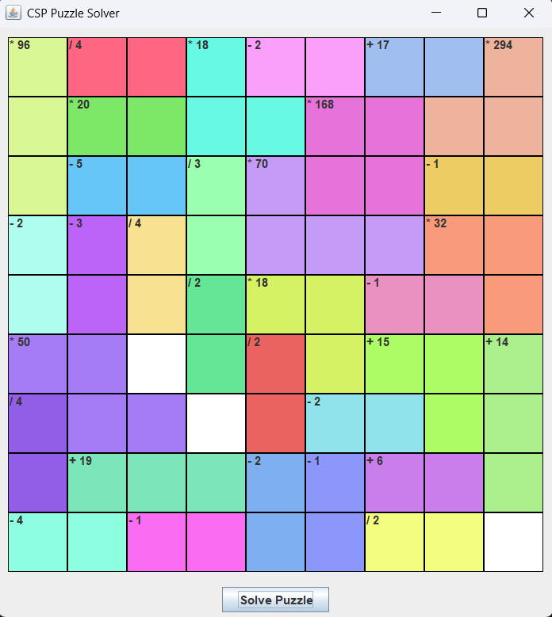

# CSP Puzzle Solver

A Java implementation of a Constraint Satisfaction Problem (CSP) solver for arithmetic puzzles. The solver uses advanced techniques including Arc Consistency (AC-3), Forward Checking, and Minimum Remaining Values (MRV) heuristic.

## Problem Description

Given a grid of size NxN, the puzzle consists of groups of adjacent cells. Each group has:
- An arithmetic operator (+, -, *, /)
- A target number
- 2 or more adjacent cells

The goal is to fill the grid with numbers 1 to N such that:
1. Each digit appears exactly once in each row
2. Each digit appears exactly once in each column
3. When applying the group's operator to its cells' values, the result equals the target number

## Features

1. **Advanced CSP Techniques**
   - Arc Consistency (AC-3) for domain reduction
   - Forward Checking to prevent future conflicts
   - MRV (Minimum Remaining Values) heuristic for variable selection

2. **Arithmetic Operations**
   - Addition (+): Sum of cells equals target
   - Subtraction (-): Absolute difference between cells equals target
   - Multiplication (*): Product of cells equals target
   - Division (/): Larger number divided by smaller equals target

3. **Visual Interface**
   - Java Swing-based GUI
   - Color-coded groups for easy visualization
   - Interactive solving with visual feedback
   - Dynamic color generation for unlimited groups
### Screenshots

#### Puzzle Interface

*The puzzle interface showing a 9x9 grid with colored groups and operators*

#### Solved Puzzle

*A successfully solved puzzle showing the solution with all constraints satisfied*

## Project Structure

- `src/`
  - `CSPPuzzleSolver.java`: Main solver implementation
  - `CSPPuzzleGUI.java`: Visual interface
  - `Cell.java`: Grid cell representation
  - `Group.java`: Group of cells with operator
  - `Arc.java`: Arc representation for AC-3
  - `Main.java`: Entry point with test puzzles

## How to Run

1. **Compile the Code**
   ```bash
   cd src
   javac *.java
   ```

2. **Run with GUI**
   ```bash
   java CSPPuzzleGUI
   ```

3. **Run with Command Line**
   ```bash
   java Main
   ```

## Implementation Details

### CSP Formulation
- **Variables**: Each cell in the grid
- **Domain**: Numbers from 1 to N
- **Constraints**:
  - Row uniqueness
  - Column uniqueness
  - Arithmetic group constraints

### Solving Process
1. Initialize domains (1 to N) for each cell
2. Run AC-3 to reduce domains
3. Use backtracking search with:
   - MRV for variable selection
   - Forward checking after each assignment
4. Display solution when found

## Sample Puzzles

The project includes three sample puzzles in `Main.java`:
- `puzzle1()`: Basic 6x6 puzzle with all operators
- `puzzle2()`: Medium difficulty with focus on multiplication
- `puzzle3()`: Complex puzzle with mixed operators

## Requirements

- Java 8 or higher
- Java Swing (included in JDK)

## Contributing

Feel free to contribute by:
1. Forking the repository
2. Creating a feature branch
3. Submitting a pull request
